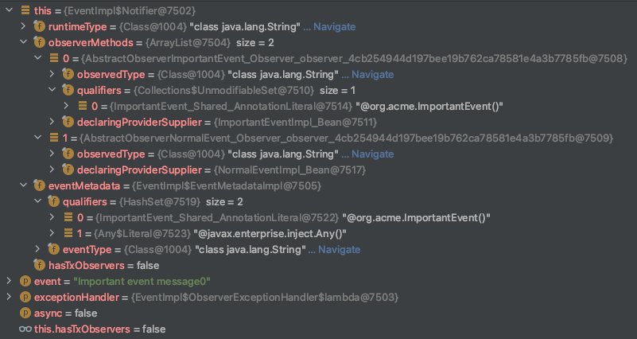

# event_qualifier_issue
### Replicates the event qualifier issue

Just do `make` in the root dir and the project will compile and run.

Do GET to http://localhost:8080/Events/Normal and check on your command line the output that should be similar to:
```text
Library AbstractObserverNormalEvent: Normal event message 0 Event qualifiers[[@org.acme.NormalEvent(), @javax.enterprise.inject.Any()]]
Runner NormalEventImpl: Normal event message 0
```

Do GET to http://localhost:8080/Events/Important and check on your command line the output that should be similar to:
```text
Library AbstractObserverNormalEvent: Important event message 0 Event qualifiers[[@org.acme.ImportantEvent(), @javax.enterprise.inject.Any()]]
Runner NormalEventImpl: Important event message 0
Library AbstractObserverImportantEvent: Important event message 0 Event qualifiers[[@org.acme.ImportantEvent(), @javax.enterprise.inject.Any()]]
Runner ImportantEventImpl: Important event message 0
```

With the two observers defined as:

```java
public abstract class AbstractObserverNormalEvent {
    public abstract void eventFired(final String message);
    public void observer(@Observes @NormalEvent final String message, final EventMetadata metadata) {
        System.out.println("Library AbstractObserverNormalEvent: " + message + " Event qualifiers[" + metadata.getQualifiers().toString() + "]");
        eventFired(message);
    }
}

public abstract class AbstractObserverImportantEvent {
    public abstract void eventFired(final String message);
    public void observer(@Observes @ImportantEvent final String message, final EventMetadata metadata) {
        System.out.println("Library AbstractObserverImportantEvent: " + message + " Event qualifiers[" + metadata.getQualifiers().toString() + "]");
        eventFired(message);
    }
}
```

We can see that the `AbstractObserverNormalEvent.observer()` shouldn't be triggered for the event with the `@org.acme.ImportantEvent()` qualifier, nevertheless, it is and this is the issue in question.

Debugging the problem I can see that the observer method in the `AbstractObserverNormalEvent.observer()` does not have the `@org.acme.NormalEvent()` qualifier and so it behaves like a general observer.

